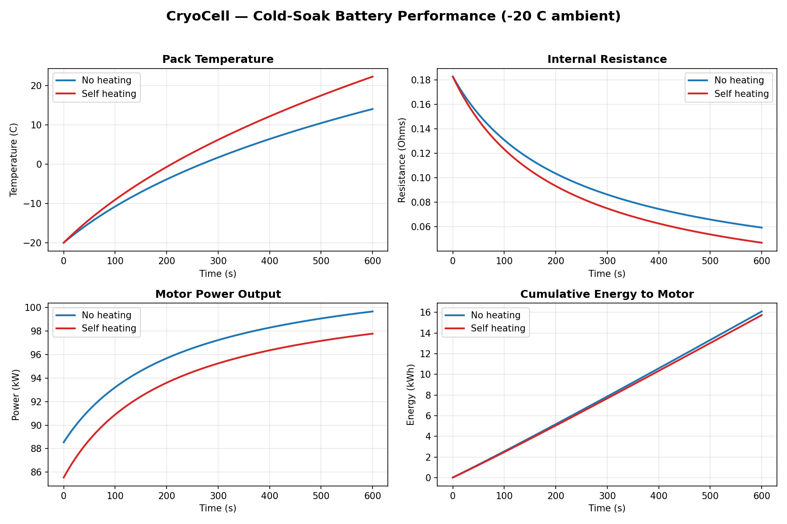

# CryoCell: Cold-Environment Battery Thermal Simulator

A discrete-time C++ simulator that models how extreme cold degrades a
lithium-ion battery pack, and evaluates the power trade-off between
**self-heating** and **usable motor output** in More Electric Aircraft (MEA)
applications.



## Overview

As aerospace shifts toward hybrid-electric propulsion, cold-weather battery
performance becomes a critical design constraint. At low temperatures the
internal resistance of a lithium-ion cell rises sharply, causing voltage sag
and reduced power delivery to the motor.

CryoCell models a 350 V / 230 Ah pack cold-soaked to **-20 °C** and simulates
its behaviour second-by-second over a 10-minute window, comparing two
strategies:

- **No heating** — all current goes to the motor; the pack warms only from its
  own internal (Joule) heating.
- **Self-heating** — a portion of pack power is diverted to a heater to warm
  the cells faster, at the cost of immediate motor output.

## Key Finding

With a **3 kW heater**, self-heating **does not pay off** within a 10-minute
cold start: the continuous heater draw outweighs the resistance savings, so the
no-heating strategy delivers more total energy to the motor (16.08 kWh vs
15.74 kWh). This demonstrates that a 3 kW heater is **over-specified** for this
flight phase — a concrete, simulator-derived design conclusion.

## Physics Modeled

| Effect | Model |
|---|---|
| Internal resistance vs. temperature | Arrhenius equation (Ea = 20 kJ/mol) |
| Self-heating | Joule heating (I²R) + dedicated heater power |
| Heat loss to ambient | Newton's law of cooling (convective) |
| Thermal response | Lumped capacitance (single thermal mass) |
| Voltage sag | Equivalent circuit model: V = V_ocv − I·R |

## Tech Stack

- **C++17** — core simulation (chosen to demonstrate high-speed, embedded
  flight-software skills)
- **Python (matplotlib)** — results visualization
- **Make** — build system

## Project Structure

```
CryoCell/
├── include/            # Header files (.h)
│   ├── battery_model.h
│   └── simulation.h
├── src/                # Source files (.cpp)
│   ├── main.cpp        # Entry point — configures and runs the sim
│   ├── battery_model.cpp
│   └── simulation.cpp
├── scripts/
│   └── plot_results.py # Renders results/simulation_plot.png from the CSV
├── results/            # Simulation output (CSV + plot)
├── Makefile
├── ROADMAP.md
└── README.md
```

## Build & Run

```bash
make          # compile the simulator
make run      # compile + run the simulation (writes results/simulation.csv)
make plot     # run, then generate results/simulation_plot.png
make clean    # remove build artifacts
```

Requires `g++` (C++17) and Python 3 with `matplotlib` for plotting.

## Roadmap

See [ROADMAP.md](ROADMAP.md) for development phases and progress.
